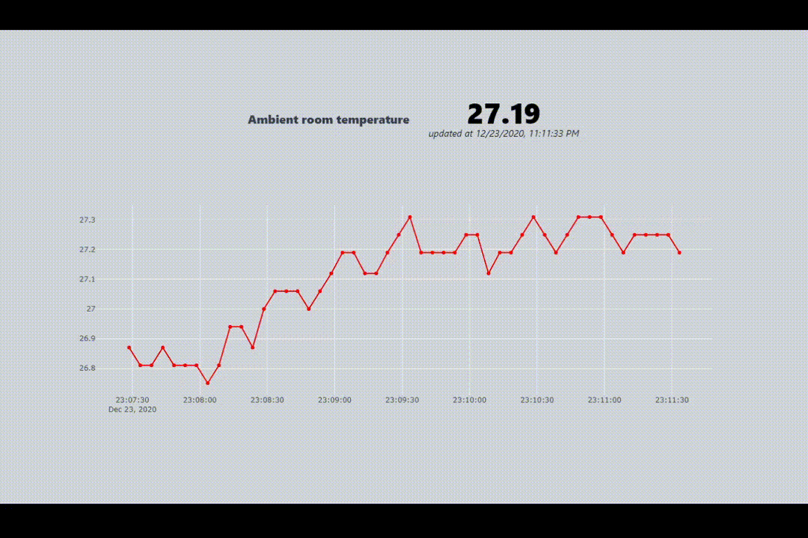

# Ambient temperature dashboard

#### Overview

The app relies on an Arduino Uno plugged in to a USB port and reads data periodically from an ambient temperature sensor attached to the Arduino. Backend uses a node app to read the data and ingest it to a `mongodb` collection, a `expressjs` app to host an API to provide last n data points, and a `reactjs` app which renders the data in a simple page.

#### Demonstration

#### Setup

##### Arduino

Follow the instructions from [here](https://arduinomodules.info/ky-001-temperature-sensor-module/). Code available in the arduino folder. Once the sketch is uploaded, use the serial monitor (within Arduino IDE) to check if the sensor works. 

##### Backend

Uses `mongodb` as the database. `Nodejs` app (`ingestData.js`) reads the data from serial port and pushes it to the database. An API client (`server.js`), based on `expressjs`, listens to `GET` requests on the `/readings` endpoint and serves last n data points (`?limit=n`)

Start backend service by navigating to the server directory and running `npm start`

##### Frontend

A `reactjs` app which fetches data periodically and renders a `plotly` line chart. Uses `tailwindcss` for css. Start the development server using `yarn start` after navigating to the client directory